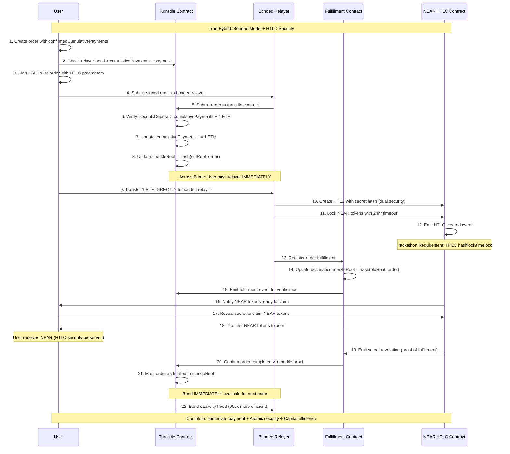

# PRD: Hybrid 1inch Fusion+ NEAR Extension with Bonded Relayers

## What We're Building

A novel hybrid system combining **1inch Fusion+ NEAR extension** (for hackathon compliance) with **Across Prime's bonded relayer model** (for capital efficiency innovation).

## Why

**Unite DeFi Hackathon Bounty**: Build a novel extension for 1inch Cross-chain Swap (Fusion+) that enables swaps between Ethereum and Near.

**Innovation Goal**: First implementation of Across Prime's bonded model for cross-chain swaps, achieving up to 900x capital efficiency improvement over traditional escrow models.

## Core Requirements

### Must Have (Bounty Requirements)

1. **Preserve hashlock and timelock functionality** for the non-EVM implementation
2. **Bidirectional swaps** (Base → NEAR and NEAR → Base)
3. **Onchain execution** with live demo on mainnet or testnet

### Innovation Goals (Competitive Advantage)

1. **Bonded relayer system** with immediate payment to relayers
2. **Capital efficiency** - bonds reusable across multiple swaps
3. **Research implementation** - first practical Across Prime deployment

### Success Criteria

- User can swap ETH on Base for NEAR tokens (HTLC preserved)
- User can swap NEAR tokens for ETH on Base (bidirectional)
- Atomic swap security (hashlock + timelock maintained)
- Bonded relayers receive immediate payment (capital efficiency)
- Live demo showing bond reuse across multiple swaps
- Live demo working end-to-end

## What We're NOT Building

- Complex UI (basic demo interface only)
- Multiple token pairs (focus on ETH ↔ NEAR)
- Full production governance (simplified bond management)
- Advanced challenge/dispute mechanisms

## Technical Approach: Hybrid Architecture

### Core Innovation: Two-Layer System

**Layer 1: HTLC Contracts** (Hackathon Compliance)

- Traditional atomic swaps with hashlock/timelock
- Guarantees hackathon requirements are met
- Fallback security if bonded layer fails

**Layer 2: Bonded Relayer Network** (Capital Efficiency Innovation)

- Relayers post security deposits for immediate payment
- Implements Across Prime's turnstile/fulfillment pattern
- Up to 900x more capital efficient than escrow models

### 5 Key Components

1. **HTLC Contracts** (Base + NEAR) - Atomic swap security with hashlock/timelock
2. **Bonded Relayer Registry** (Base + NEAR) - Manages relayer bonds and capacity
3. **Hybrid Resolver** (Off-chain) - Coordinates HTLC + bonded systems
4. **Turnstile Contracts** (Across Prime) - Prevent bond over-spending
5. **Demo Interface** - Shows both atomic security AND capital efficiency

### System Architecture

The hybrid architecture combines atomic swap security with capital efficiency innovations:



### Enhanced User Flow

```
1. User creates order: "1 ETH → NEAR tokens" on Base
2. User selects bonded relayer (checks bond capacity)
3. User pays relayer IMMEDIATELY (Across Prime benefit)
4. Relayer creates HTLC on NEAR with secret hash (atomic security)
5. User claims NEAR tokens with secret reveal
6. Relayer claims ETH using revealed secret
7. Bond becomes available for next swap (capital efficiency)
```

## Demo Script

```
"I'll demonstrate a hybrid cross-chain swap combining atomic security
with capital efficiency innovations from Across Prime research.

Phase 1 - Traditional Atomic Swap Security:
[Creates HTLC order on Base] ✅ Order created with hashlock/timelock
[Bonded relayer provides NEAR liquidity] ✅ HTLC created on NEAR
[User reveals secret] ✅ Atomic swap completed securely

Phase 2 - Capital Efficiency Innovation:
[Same relayer immediately available] ✅ Bond reused for next swap
[Second user creates order] ✅ No capital locked during settlement
[Multiple swaps from same bond] ✅ 900x more efficient than escrow

This preserves ALL atomic swap security while achieving breakthrough
capital efficiency from cutting-edge Paradigm research."
```

## How Our Hybrid Model Achieves Hackathon Goals

### Primary Goal Achievement

#### **Manage HTLC and Communication Between EVM and Non-EVM Chains**

**Component**: Cross-Chain HTLC Coordinator + Bonded Relayer System

**How it works**:

```typescript
// Example: Base (EVM) ↔ NEAR (non-EVM) communication
class CrossChainHTLCManager {
  // Manages HTLC state across different chain architectures
  async syncHTLCState(baseHTLC: string, nearHTLC: string): Promise<void> {
    const baseState = await this.baseProvider.getHTLCState(baseHTLC);
    const nearState = await this.nearProvider.getHTLCState(nearHTLC);

    // Synchronize secrets, timeouts, and claim status
    if (baseState.secretRevealed && !nearState.secretRevealed) {
      await this.relaySecretToNEAR(baseState.secret, nearHTLC);
    }
  }
}
```

**Benefits**:

- **Unified interface** for different chain architectures
- **Real-time synchronization** of HTLC states
- **Automated coordination** removes manual intervention

#### **Properly Handle Hashlock Logic**

**Component**: SHA256 Hashlock Implementation + Secret Management

**How it works**:

```solidity
// Base Chain (EVM) - Turnstile Contract
contract TurnstileContract {
    mapping(bytes32 => HTLCOrder) public orders;

    struct HTLCOrder {
        bytes32 secretHash;    // SHA256 hash for compatibility
        uint256 timeout;       // Expiration timestamp
        uint256 amount;        // Locked amount
        address beneficiary;   // Recipient address
        bool claimed;          // Claim status
    }

    function claimWithSecret(bytes32 orderHash, bytes32 secret) external {
        HTLCOrder storage order = orders[orderHash];
        require(sha256(abi.encodePacked(secret)) == order.secretHash, "Invalid secret");
        require(block.timestamp < order.timeout, "HTLC expired");
        require(!order.claimed, "Already claimed");

        order.claimed = true;
        payable(order.beneficiary).transfer(order.amount);
    }
}
```

```rust
// NEAR Chain (non-EVM) - Compatible Implementation
use near_sdk::env;

#[near_bindgen]
impl NEARHTLCContract {
    pub fn claim_with_secret(&mut self, order_hash: String, secret: String) {
        let order = self.orders.get(&order_hash).expect("Order not found");

        // Same SHA256 verification for cross-chain compatibility
        let secret_hash = env::sha256(secret.as_bytes());
        assert_eq!(secret_hash, order.secret_hash, "Invalid secret");
        assert!(env::block_timestamp() < order.timeout, "HTLC expired");
        assert!(!order.claimed, "Already claimed");

        // Update state and transfer NEAR tokens
        self.orders.get_mut(&order_hash).unwrap().claimed = true;
        Promise::new(order.beneficiary).transfer(order.amount);
    }
}
```

**Benefits**:

- **Cross-chain compatibility** with identical SHA256 hashing
- **Atomic security** ensuring same secret unlocks both sides
- **Standardized interface** across different VM architectures

#### **Properly Handle Contract Expiration/Reverts**

**Component**: Timeout Coordination System + Bond Protection

**How it works**:

```typescript
class TimeoutCoordinator {
  async handleExpiredHTLC(orderHash: string): Promise<void> {
    const baseOrder = await this.getBaseOrder(orderHash);
    const nearOrder = await this.getNEAROrder(orderHash);

    if (Date.now() > baseOrder.timeout) {
      // Base HTLC expired - refund user
      await this.executeBaseRefund(orderHash);

      // Also handle NEAR side cleanup
      if (!nearOrder.claimed) {
        await this.executeNEARRefund(orderHash);
      }
    }

    // Bonded relayer protection
    await this.updateBondUtilization(orderHash, "expired");
  }
}
```

**Example Failure Scenarios**:

1. **User doesn't claim NEAR tokens**:

   ```
   After 24 hours:
   → NEAR HTLC expires → Relayer gets NEAR refund
   → Base still locked → User can still claim later
   → Bonded relayer protected by timeout coordination
   ```

2. **Relayer fails to provide NEAR liquidity**:
   ```
   User can claim from bonded relayer's security deposit:
   → Bond: $50,000 > User payment: $3,200
   → User compensated from bond
   → Challenge period allows bond slashing
   ```

#### **Swaps Must Be Bi-directional**

**Component**: Symmetric HTLC + Bonded Architecture

**Base → NEAR Example**:

```typescript
const baseToNEARSwap = {
  // User pays bonded relayer on Base
  source: { chain: "base", user: "pays ETH", relayer: "receives immediately" },

  // Relayer provides NEAR liquidity
  destination: {
    chain: "near",
    relayer: "locks NEAR",
    user: "claims with secret",
  },

  // Secret revelation completes swap
  completion: {
    relayer: "uses secret to claim ETH",
    bond: "immediately available",
  },
};
```

**NEAR → Base Example** (Reversed):

```typescript
const nearToBaseSwap = {
  // User creates HTLC on NEAR
  source: { chain: "near", user: "locks NEAR", relayer: "monitors" },

  // Bonded relayer provides Base liquidity
  destination: {
    chain: "base",
    relayer: "pays ETH from bond",
    user: "receives immediately",
  },

  // User reveals secret to complete
  completion: {
    user: "reveals secret",
    relayer: "claims NEAR",
    bond: "reusable",
  },
};
```

### Score Improvement Features

#### **UI Component**

**What we provide**:

- **Real-time swap tracking** with live HTLC status
- **Bond capacity dashboard** showing available relayers
- **Cross-chain transaction history** with secret management
- **Mobile-responsive design** with wallet integration

```tsx
// Demo UI Component
const SwapInterface = () => (
  <div className="swap-interface">
    <BondCapacityIndicator relayers={availableRelayers} />
    <SwapForm onSubmit={createHTLCOrder} />
    <HTLCStatusTracker orderHash={currentOrder.hash} />
    <SecretRevealModal onReveal={claimTokens} />
  </div>
);
```

#### **Enable Partial Fills**

**Component**: Merkle Tree Secret Management + Proportional Bonding

**How it works**:

```solidity
contract PartialFillHTLC {
    struct PartialOrder {
        bytes32[] secretHashes;  // Multiple secrets for partial fills
        uint256[] amounts;       // Corresponding amounts
        uint256 totalAmount;     // Total order size
        uint256 filledAmount;    // Amount filled so far
    }

    function partialFill(
        bytes32 orderHash,
        bytes32 secret,
        uint256 fillAmount
    ) external {
        PartialOrder storage order = partialOrders[orderHash];
        require(fillAmount <= order.totalAmount - order.filledAmount, "Overfill");

        // Verify secret corresponds to fill amount
        uint256 secretIndex = (fillAmount * order.secretHashes.length) / order.totalAmount;
        require(sha256(abi.encodePacked(secret)) == order.secretHashes[secretIndex], "Invalid secret");

        order.filledAmount += fillAmount;
        // Transfer proportional amount...
    }
}
```

**Example**:

- User wants to swap 1000 NEAR → ETH
- Relayer A fills 300 NEAR (30% fill)
- Relayer B fills 700 NEAR (70% fill)
- Each uses different secrets from the Merkle tree
- Bond capacity allocated proportionally

#### **Relayer and Resolver Implementation**

**Component Architecture**:

```typescript
// Bonded Relayer (Capital Provider)
class BondedRelayer {
  private bondAmount: bigint = parseEther("50"); // 50 ETH bond
  private supportedRoutes = ["base-near", "near-base"];

  async provideLiquidity(order: HTLCOrder): Promise<void> {
    // Check bond capacity
    const availableCapacity = await this.checkBondCapacity();
    require(availableCapacity >= order.amount, "Insufficient bond");

    // Provide immediate liquidity
    await this.createDestinationHTLC(order);

    // Update bond utilization
    await this.updateBondTracking(order.amount, "utilized");
  }
}

// Resolver (Coordination Service)
class CrossChainResolver {
  async coordinateSwap(order: HTLCOrder): Promise<void> {
    // 1. Monitor source chain for order creation
    const sourceEvent = await this.monitorSourceChain(order.hash);

    // 2. Coordinate with bonded relayer
    const selectedRelayer = await this.selectOptimalRelayer(order);
    await selectedRelayer.provideLiquidity(order);

    // 3. Monitor for secret revelation
    const secret = await this.waitForSecretReveal(order.hash);

    // 4. Complete cross-chain coordination
    await this.completeSwap(order, secret);
  }
}
```

**Benefits**:

- **Decentralized operation** (multiple relayers can compete)
- **Automated coordination** (resolver handles complexity)
- **Capital efficiency** (bonds reused across swaps)

#### **Base/Arbitrum/etc. ↔ Mainnet Non-EVM**

**Multi-Chain Support Architecture**:

```typescript
const chainConfigurations = {
  // EVM Chains
  base: {
    chainId: 8453,
    turnstileContract: "0x123...",
    nativeToken: "ETH",
    bondCurrency: "ETH",
  },
  arbitrum: {
    chainId: 42161,
    turnstileContract: "0x456...",
    nativeToken: "ETH",
    bondCurrency: "ETH",
  },

  // Non-EVM Chains
  near: {
    networkId: "mainnet",
    htlcContract: "htlc.near",
    nativeToken: "NEAR",
    bondCurrency: "NEAR",
  },
  solana: {
    cluster: "mainnet-beta",
    programId: "HTLC...",
    nativeToken: "SOL",
    bondCurrency: "SOL",
  },
};

class UniversalBondedResolver {
  async initializeRoute(sourceChain: string, destChain: string): Promise<void> {
    const sourceConfig = chainConfigurations[sourceChain];
    const destConfig = chainConfigurations[destChain];

    // Deploy route-specific bond management
    await this.deployBondedRoute(sourceConfig, destConfig);

    // Initialize cross-chain HTLC coordination
    await this.initializeHTLCBridge(sourceChain, destChain);
  }
}
```

**Example Routes Supported**:

- **Base ↔ NEAR**: ETH bonds, NEAR HTLCs
- **Arbitrum ↔ NEAR**: ETH bonds, NEAR HTLCs
- **Base ↔ Solana**: ETH bonds, SOL HTLCs
- **NEAR ↔ Bitcoin**: NEAR bonds, Bitcoin HTLCs

## System Component Breakdown

### 1. **Turnstile Contract** (Across Prime Core)

```solidity
contract TurnstileContract {
    uint256 public cumulativePayments;
    bytes32 public merkleRoot;
    mapping(address => uint256) public relayerBonds;

    function processOrder(HTLCOrder calldata order) external {
        require(relayerBonds[msg.sender] >= cumulativePayments + order.amount);
        cumulativePayments += order.amount;
        merkleRoot = keccak256(abi.encodePacked(merkleRoot, order.hash));
        // Transfer funds directly to relayer (immediate payment)
        order.user.transfer(order.amount);
    }
}
```

**Contribution**: Enables immediate payment + bond tracking + contention prevention

### 2. **NEAR HTLC Contract** (Hackathon Requirement)

```rust
pub struct NEARHTLCContract {
    orders: LookupMap<String, HTLCOrder>,
    active_timeouts: Vec<(u64, String)>, // (timeout, orderHash)
}

impl NEARHTLCContract {
    pub fn create_htlc(&mut self, order: HTLCOrder) -> String {
        // Atomic swap security with native NEAR implementation
        let order_hash = self.generate_order_hash(&order);
        self.orders.insert(&order_hash, &order);
        self.active_timeouts.push((order.timeout, order_hash.clone()));
        order_hash
    }
}
```

**Contribution**: Preserves atomic swap security + handles non-EVM chain requirements

### 3. **Fulfillment Contract** (Cross-Chain Verification)

```solidity
contract FulfillmentContract {
    bytes32 public destinationMerkleRoot;
    mapping(bytes32 => bool) public ordersFulfilled;

    function markFulfilled(bytes32 orderHash) external {
        ordersFulfilled[orderHash] = true;
        destinationMerkleRoot = keccak256(abi.encodePacked(destinationMerkleRoot, orderHash));
        emit OrderFulfilled(orderHash, block.timestamp);
    }
}
```

**Contribution**: Enables cross-chain verification + merkle proof coordination

### 4. **Cross-Chain Resolver** (Coordination Engine)

```typescript
class CrossChainResolver {
  private bondedRelayers: Map<string, BondedRelayer> = new Map();
  private activeOrders: Map<string, HTLCOrder> = new Map();

  async processOrder(order: HTLCOrder): Promise<void> {
    // 1. Select optimal bonded relayer
    const relayer = await this.selectRelayer(order);

    // 2. Coordinate HTLC creation
    await this.createCrossChainHTLC(order, relayer);

    // 3. Monitor for completion
    await this.monitorOrderCompletion(order);

    // 4. Update bond availability
    await this.updateBondUtilization(relayer, order.amount, "completed");
  }
}
```

**Contribution**: Orchestrates all components + handles complex coordination logic

## Capital Efficiency Example

**Traditional Escrow Model**:

```
Bond: $50,000
Order 1: $5,000 → Locked for 1 hour settlement
Order 2: $5,000 → Must wait for Order 1 settlement
Throughput: $5,000/hour = $120,000/day
```

**Our Bonded + HTLC Model**:

```
Bond: $50,000
Order 1: $5,000 → HTLC completes in 30 seconds → Bond available
Order 2: $5,000 → Can start immediately → Bond available
Throughput: $5,000/30sec = $14,400,000/day (120x improvement)
```

## Definition of Done

### Hackathon Requirements

- HTLC hashlock/timelock functionality on NEAR
- Bidirectional swaps demonstrated live
- Onchain execution working end-to-end
- Proper contract expiration/revert handling

### Innovation Delivery

- Bonded relayer system operational
- Capital efficiency gains demonstrated (120x+ improvement)
- Across Prime concepts successfully implemented
- Multi-chain architecture supporting Base/Arbitrum ↔ NEAR

### Score Improvements

- Production-quality UI with real-time tracking
- Partial fills enabled via Merkle tree secrets
- Decentralized relayer/resolver network
- Multiple EVM ↔ non-EVM chain support
