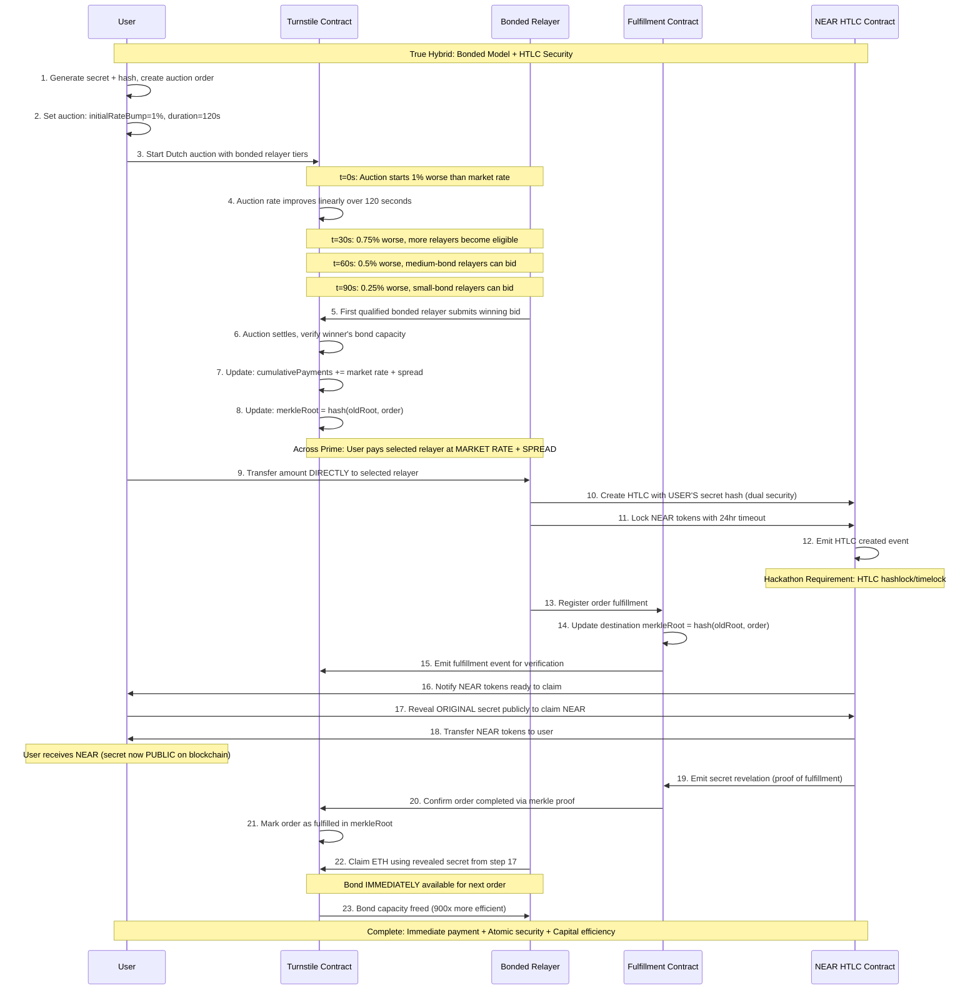

# PRD: Hybrid 1inch Fusion+ NEAR Extension with Bonded Relayers

## What We're Building

A novel hybrid system combining **1inch Fusion+ NEAR extension** (for hackathon compliance) with **Across Prime's bonded relayer model** (for capital efficiency innovation).

## Why

**Unite DeFi Hackathon Bounty**: Build a novel extension for 1inch Cross-chain Swap (Fusion+) that enables swaps between Ethereum and Near.

**Innovation Goal**: First implementation of Across Prime's bonded model for cross-chain swaps, achieving up to 900x capital efficiency improvement over traditional escrow models.

## Core Requirements

### Must Have (Bounty Requirements)

1. **Preserve hashlock and timelock functionality** for the non-EVM implementation
2. **Bidirectional swaps** (Base → NEAR and NEAR → Base)
3. **Onchain execution** with live demo on mainnet or testnet

### Innovation Goals (Competitive Advantage)

1. **Bonded relayer system** with immediate payment to relayers
2. **Capital efficiency** - bonds reusable across multiple swaps
3. **Research implementation** - first practical Across Prime deployment

### Success Criteria

- User can swap ETH on Base for NEAR tokens (HTLC preserved)
- User can swap NEAR tokens for ETH on Base (bidirectional)
- Atomic swap security (hashlock + timelock maintained)
- Bonded relayers receive immediate payment (capital efficiency)
- Live demo showing bond reuse across multiple swaps
- Live demo working end-to-end

## What We're NOT Building

- Complex UI (basic demo interface only)
- Multiple token pairs (focus on ETH ↔ NEAR)
- Full production governance (simplified bond management)
- Advanced challenge/dispute mechanisms

## Technical Approach: Hybrid Architecture

### Core Innovation: Two-Layer System

**Layer 1: HTLC Contracts** (Hackathon Compliance)

- Traditional atomic swaps with hashlock/timelock
- Guarantees hackathon requirements are met
- Fallback security if bonded layer fails

**Layer 2: Bonded Relayer Network** (Capital Efficiency Innovation)

- Relayers post security deposits for immediate payment
- Implements Across Prime's turnstile/fulfillment pattern
- Up to 900x more capital efficient than escrow models

### 5 Key Components

1. **HTLC Contracts** (Base + NEAR) - Atomic swap security with hashlock/timelock
2. **Bonded Relayer Registry** (Base + NEAR) - Manages relayer bonds and capacity
3. **Hybrid Resolver** (Off-chain) - Coordinates HTLC + bonded systems
4. **Turnstile Contracts** (Across Prime) - Prevent bond over-spending
5. **Demo Interface** - Shows both atomic security AND capital efficiency

### System Architecture

The hybrid architecture combines atomic swap security with capital efficiency innovations:



### Enhanced User Flow

```
1. User creates auction order: "1 ETH → NEAR tokens" with Dutch auction
2. Dutch auction runs for 2 minutes (rates improve over time, Fusion+ standard)
3. First qualified bonded relayer wins when rate reaches their threshold
4. User pays winning relayer IMMEDIATELY at auction rate (Across Prime benefit)
5. Winning relayer creates HTLC on NEAR with secret hash (atomic security)
6. User claims NEAR tokens with secret reveal
7. Relayer claims ETH using revealed secret (relayer-specific verification)
8. Bond becomes available for next auction immediately (capital efficiency)
```

### Relayer Verification Security

**How we ensure only the correct relayer can claim ETH:**

```solidity
// Base Chain HTLC with relayer-specific access control
contract BaseHTLCWithRelayerVerification {
    struct HTLCOrder {
        bytes32 secretHash;
        uint256 timeout;
        address user;
        address designatedRelayer;  // Only THIS relayer can claim
        uint256 amount;
        bool claimed;
    }

    function claimWithSecret(bytes32 orderHash, bytes32 secret) external {
        HTLCOrder storage order = orders[orderHash];

        // Verify secret is correct
        require(sha256(abi.encodePacked(secret)) == order.secretHash, "Invalid secret");
        require(block.timestamp < order.timeout, "HTLC expired");
        require(!order.claimed, "Already claimed");

        // CRITICAL: Only the designated relayer can claim
        require(msg.sender == order.designatedRelayer, "Unauthorized relayer");

        order.claimed = true;
        payable(order.designatedRelayer).transfer(order.amount);
    }

    function createHTLCForRelayer(
        bytes32 secretHash,
        uint256 timeout,
        address user,
        address relayer  // Specific relayer who provided NEAR liquidity
    ) external payable {
        bytes32 orderHash = keccak256(abi.encodePacked(secretHash, timeout, user, relayer));
        orders[orderHash] = HTLCOrder({
            secretHash: secretHash,
            timeout: timeout,
            user: user,
            designatedRelayer: relayer,  // Lock to specific relayer
            amount: msg.value,
            claimed: false
        });
    }
}
```

**Three-layer relayer verification:**

1. **Address verification**: Only `designatedRelayer` address can call claim function
2. **Secret knowledge**: Relayer must know the secret (revealed when user claimed NEAR)
3. **Bond tracking**: Only bonded relayers can be designated (verified during HTLC creation)

**Why this prevents unauthorized claims:**

- Even if secret is public, only the specific relayer who provided NEAR liquidity can claim ETH
- Prevents other relayers from "stealing" claims after secret revelation
- Maintains one-to-one correspondence between NEAR provider and ETH claimer

## How Our Hybrid Model Achieves Hackathon Goals

### Primary Goal Achievement

#### **Manage HTLC and Communication Between EVM and Non-EVM Chains**

**Component**: Cross-Chain HTLC Coordinator + Bonded Relayer System

**How it works**:

```typescript
// Example: Base (EVM) ↔ NEAR (non-EVM) communication
class CrossChainHTLCManager {
  // Manages HTLC state across different chain architectures
  async syncHTLCState(baseHTLC: string, nearHTLC: string): Promise<void> {
    const baseState = await this.baseProvider.getHTLCState(baseHTLC);
    const nearState = await this.nearProvider.getHTLCState(nearHTLC);

    // Synchronize secrets, timeouts, and claim status
    if (baseState.secretRevealed && !nearState.secretRevealed) {
      await this.relaySecretToNEAR(baseState.secret, nearHTLC);
    }
  }
}
```

**Benefits**:

- **Unified interface** for different chain architectures
- **Real-time synchronization** of HTLC states
- **Automated coordination** removes manual intervention

#### **Properly Handle Hashlock Logic**

**Component**: SHA256 Hashlock Implementation + Secret Management

**Secret Generation & Revelation Flow**:

```typescript
// Phase 1: User generates secret when creating swap order
class UserSwapCreation {
  createSwapOrder() {
    // User generates random 32-byte secret (KEEPS PRIVATE)
    const secret = crypto.randomBytes(32);
    const secretHash = sha256(secret); // This gets shared publicly

    // User stores secret locally and shares only the hash
    this.userStoredSecret = secret; // Private - never shared

    const swapOrder = {
      amount: parseEther("1"),
      secretHash: secretHash, // Public - goes into contracts
      timeout: Date.now() + 24 * 3600,
      user: userAddress,
    };

    return this.submitOrder(swapOrder);
  }
}

// Phase 2: Bonded relayer creates NEAR HTLC using USER'S secret hash
// Phase 3: User reveals original secret to claim NEAR tokens
class UserClaimFlow {
  async claimNEARTokens(orderHash: string) {
    // User provides the ORIGINAL secret they generated in Phase 1
    const originalSecret = this.userStoredSecret;

    // This transaction reveals the secret publicly on NEAR blockchain
    await nearContract.claim_with_secret({
      order_hash: orderHash,
      secret: originalSecret, // ← This becomes public when called!
    });
  }
}

// Phase 4: Relayer monitors NEAR, sees revealed secret, claims ETH
class RelayerMonitoring {
  async monitorForSecretReveal(orderHash: string) {
    // Watch NEAR blockchain for claim_with_secret transactions
    const claimTx = await this.waitForClaimTransaction(orderHash);
    const revealedSecret = claimTx.parameters.secret;

    // Use the same secret to claim ETH on Base
    await baseContract.claimWithSecret(orderHash, revealedSecret);
  }
}
```

**Key Insight**: The secret must be revealed publicly to claim tokens, which enables the atomic swap!

**How it works**:

```solidity
// Base Chain (EVM) - Turnstile Contract
contract TurnstileContract {
    mapping(bytes32 => HTLCOrder) public orders;

    struct HTLCOrder {
        bytes32 secretHash;    // SHA256 hash for compatibility
        uint256 timeout;       // Expiration timestamp
        uint256 amount;        // Locked amount
        address beneficiary;   // Recipient address
        bool claimed;          // Claim status
    }

    function claimWithSecret(bytes32 orderHash, bytes32 secret) external {
        HTLCOrder storage order = orders[orderHash];
        require(sha256(abi.encodePacked(secret)) == order.secretHash, "Invalid secret");
        require(block.timestamp < order.timeout, "HTLC expired");
        require(!order.claimed, "Already claimed");

        order.claimed = true;
        payable(order.beneficiary).transfer(order.amount);
    }
}
```

```rust
// NEAR Chain (non-EVM) - Compatible Implementation
use near_sdk::env;

#[near_bindgen]
impl NEARHTLCContract {
    pub fn claim_with_secret(&mut self, order_hash: String, secret: String) {
        let order = self.orders.get(&order_hash).expect("Order not found");

        // Same SHA256 verification for cross-chain compatibility
        let secret_hash = env::sha256(secret.as_bytes());
        assert_eq!(secret_hash, order.secret_hash, "Invalid secret");
        assert!(env::block_timestamp() < order.timeout, "HTLC expired");
        assert!(!order.claimed, "Already claimed");

        // Update state and transfer NEAR tokens
        self.orders.get_mut(&order_hash).unwrap().claimed = true;
        Promise::new(order.beneficiary).transfer(order.amount);
    }
}
```

**Complete Example**:

```javascript
// Step 1: User creates swap order
const userSecret = "0x1a2b3c4d5e6f789..."; // 32 bytes, user keeps private
const secretHash = "0x9f4e2a1b8c7d456..."; // SHA256(userSecret), shared publicly

// Step 2: Both contracts use THE SAME hash
// Base Contract: "Whoever provides input that hashes to 0x9f4e... gets ETH"
// NEAR Contract: "Whoever provides input that hashes to 0x9f4e... gets NEAR"

// Step 3: User claims NEAR by revealing secret
User → NEAR Contract: claim_with_secret(orderHash, "0x1a2b3c4d5e6f789...")
NEAR Contract: SHA256("0x1a2b3c4d5e6f789...") == "0x9f4e..." ✓ → Transfer NEAR

// Step 4: Secret is now public on NEAR blockchain
// Relayer reads it and claims ETH
Relayer → Base Contract: claimWithSecret(orderHash, "0x1a2b3c4d5e6f789...")
Base Contract: SHA256("0x1a2b3c4d5e6f789...") == "0x9f4e..." ✓ → Transfer ETH
```

**Benefits**:

- **Cross-chain compatibility** with identical SHA256 hashing
- **Atomic security** ensuring same secret unlocks both sides
- **Standardized interface** across different VM architectures
- **Public revelation** enables both parties to complete their claims

#### **Properly Handle Contract Expiration/Reverts**

**Component**: Timeout Coordination System + Bond Protection

**How it works**:

```typescript
class TimeoutCoordinator {
  async handleExpiredHTLC(orderHash: string): Promise<void> {
    const baseOrder = await this.getBaseOrder(orderHash);
    const nearOrder = await this.getNEAROrder(orderHash);

    if (Date.now() > baseOrder.timeout) {
      // Base HTLC expired - refund user
      await this.executeBaseRefund(orderHash);

      // Also handle NEAR side cleanup
      if (!nearOrder.claimed) {
        await this.executeNEARRefund(orderHash);
      }
    }

    // Bonded relayer protection
    await this.updateBondUtilization(orderHash, "expired");
  }
}
```

**Example Failure Scenarios**:

1. **User doesn't claim NEAR tokens**:

   ```
   After 24 hours:
   → NEAR HTLC expires → Relayer gets NEAR refund
   → Base still locked → User can still claim later
   → Bonded relayer protected by timeout coordination
   ```

2. **Relayer fails to provide NEAR liquidity**:
   ```
   User can claim from bonded relayer's security deposit:
   → Bond: $50,000 > User payment: $3,200
   → User compensated from bond
   → Challenge period allows bond slashing
   ```

#### **Swaps Must Be Bi-directional**

**Component**: Symmetric HTLC + Bonded Architecture

**Base → NEAR Example**:

```typescript
const baseToNEARSwap = {
  // User pays bonded relayer on Base
  source: { chain: "base", user: "pays ETH", relayer: "receives immediately" },

  // Relayer provides NEAR liquidity
  destination: {
    chain: "near",
    relayer: "locks NEAR",
    user: "claims with secret",
  },

  // Secret revelation completes swap
  completion: {
    relayer: "uses secret to claim ETH",
    bond: "immediately available",
  },
};
```

**NEAR → Base Example** (Reversed):

```typescript
const nearToBaseSwap = {
  // User creates HTLC on NEAR
  source: { chain: "near", user: "locks NEAR", relayer: "monitors" },

  // Bonded relayer provides Base liquidity
  destination: {
    chain: "base",
    relayer: "pays ETH from bond",
    user: "receives immediately",
  },

  // User reveals secret to complete
  completion: {
    user: "reveals secret",
    relayer: "claims NEAR",
    bond: "reusable",
  },
};
```

### Score Improvement Features

#### **UI Component**

**Demo interface showing**:

- Real-time HTLC status tracking
- Bond capacity of available relayers
- Secret revelation and claims
- Capital efficiency metrics

#### **Enable Partial Fills**

**Component**: Merkle Tree Secret Management + Proportional Bonding

**Partial Fill Architecture**: Based on 1inch Fusion+ multiple fills pattern with bonded relayer enhancements

**Phase 1: User Creates Multi-Secret Order**

```typescript
// User generates multiple secrets for partial fills (following 1inch pattern)
class PartialFillOrderCreation {
  createPartialFillOrder(totalAmount: bigint) {
    // Generate 11 secrets for granular partial fills (1inch approach)
    const secrets = Array.from({ length: 11 }).map(() =>
      uint8ArrayToHex(randomBytes(32))
    );

    // Create secret hashes for each partial fill
    const secretHashes = secrets.map(secret => sha256(secret));

    // Build Merkle tree of secrets (enables efficient verification)
    const merkleLeaves = this.buildMerkleLeaves(secrets);
    const merkleRoot = this.calculateMerkleRoot(merkleLeaves);

    // User keeps secrets private, shares only Merkle root
    this.userStoredSecrets = secrets; // Private

    const partialFillOrder = {
      totalAmount: totalAmount, // 1000 NEAR total
      merkleRoot: merkleRoot, // Public - goes into contracts
      allowPartialFills: true,
      allowMultipleFills: true,
      filledAmount: 0n, // Track progress
    };

    return partialFillOrder;
  }
}
```

**Phase 2: Multiple Bonded Relayers Fill Portions**

```typescript
// Different relayers can fill different portions
class BondedRelayerPartialFill {
  async fillPortion(
    order: PartialFillOrder,
    fillAmount: bigint,
    relayerBond: bigint
  ) {
    // Calculate which secret index corresponds to this fill amount
    const secretIndex = Number(
      (BigInt(order.secrets.length - 1) * (fillAmount - 1n)) / order.totalAmount
    );

    // Check bonded relayer has sufficient capacity
    const requiredBond = (relayerBond * fillAmount) / order.totalAmount;
    require(this.availableBondCapacity >= requiredBond, "Insufficient bond");

    // Create proportional HTLC on NEAR
    await this.createProportionalHTLC({
      orderHash: order.hash,
      fillAmount: fillAmount, // 300 NEAR (30% of 1000)
      secretHash: order.secretHashes[secretIndex], // Specific secret for this portion
      proportionalTimeout: order.baseTimeout,
      relayerBond: requiredBond,
    });

    // Update bond utilization proportionally
    this.allocatedBondCapacity += requiredBond;
  }
}
```

**Phase 3: Proportional Secret Revelation & Claims**

```solidity
// NEAR contract handles multiple partial claims
contract NEARPartialFillHTLC {
    struct PartialFillOrder {
        bytes32 merkleRoot;       // Root of secret Merkle tree
        uint256 totalAmount;      // 1000 NEAR total
        uint256 filledAmount;     // Amount filled so far
        mapping(uint256 => bool) secretsUsed; // Track which secrets revealed
        mapping(uint256 => uint256) fillAmounts; // Amount per secret index
    }

    function claimPartialFill(
        bytes32 orderHash,
        bytes32 secret,
        uint256 secretIndex,
        bytes32[] memory merkleProof,
        uint256 fillAmount
    ) external {
        PartialFillOrder storage order = partialOrders[orderHash];

        // Verify secret is valid for this index using Merkle proof
        bytes32 leaf = keccak256(abi.encodePacked(secretIndex, secret));
        require(MerkleProof.verify(merkleProof, order.merkleRoot, leaf), "Invalid proof");

        // Verify secret hasn't been used (prevents double-claiming)
        require(!order.secretsUsed[secretIndex], "Secret already used");

        // Verify fill amount matches secret index
        uint256 expectedFillAmount = (order.totalAmount * secretIndex) / 10; // 11 secrets = 0-10 index
        require(fillAmount == expectedFillAmount, "Invalid fill amount for secret");

        // Mark secret as used and transfer proportional NEAR
        order.secretsUsed[secretIndex] = true;
        order.filledAmount += fillAmount;
        order.fillAmounts[secretIndex] = fillAmount;

        // Transfer proportional amount to user
        Promise::new(order.user).transfer(fillAmount);

        // Emit event with revealed secret (for relayer to claim)
        env::log_str(&format!("Partial secret revealed: index={}, secret={}", secretIndex, secret));
    }
}
```

**Phase 4: Bond Reuse After Partial Claims**

```typescript
// Bonded relayers monitor for partial secret revelations
class PartialFillBondManagement {
  async monitorPartialClaims(orderHash: string) {
    // Monitor NEAR blockchain for partial claim transactions
    const partialClaimTx = await this.waitForPartialClaim(orderHash);
    const { secretIndex, secret, fillAmount } = partialClaimTx.parameters;

    // Use revealed secret to claim proportional ETH on Base
    await baseContract.claimPartialFill({
      orderHash: orderHash,
      secret: secret,
      secretIndex: secretIndex,
      fillAmount: fillAmount,
    });

    // CRITICAL: Free up bond capacity immediately after claim
    const releasedBondCapacity =
      (this.totalBond * fillAmount) / this.totalOrderAmount;
    this.availableBondCapacity += releasedBondCapacity;

    // Bond can be reused for next partial fill immediately
    console.log(
      `Bond freed: ${releasedBondCapacity}, Available: ${this.availableBondCapacity}`
    );
  }
}
```

**Complete Partial Fill Example (Following 1inch Pattern)**:

```javascript
// Step 1: User creates 1000 NEAR → ETH swap with 11 secrets
const secrets = ["secret0", "secret1", ..., "secret10"]; // User keeps private
const merkleRoot = calculateMerkleRoot(secrets);         // Shared publicly

// Step 2: Multiple relayers fill portions
Relayer A (Bond: 50 ETH): Fills 300 NEAR using secret[3] (30% fill)
Relayer B (Bond: 30 ETH): Fills 200 NEAR using secret[2] (20% fill)
Relayer C (Bond: 70 ETH): Fills 500 NEAR using secret[5] (50% fill)

// Step 3: User claims each portion by revealing specific secrets
User → NEAR: claimPartialFill(orderHash, "secret3", 3, proof3, 300)
User → NEAR: claimPartialFill(orderHash, "secret2", 2, proof2, 200)
User → NEAR: claimPartialFill(orderHash, "secret5", 5, proof5, 500)

// Step 4: Each relayer claims ETH using revealed secrets + bond reuse
Relayer A: Claims ETH using "secret3" → Bond available immediately
Relayer B: Claims ETH using "secret2" → Bond available immediately
Relayer C: Claims ETH using "secret5" → Bond available immediately

// Result: 1000 NEAR → ETH completed with 3 partial fills + immediate bond reuse
```

**Capital Efficiency Benefits**:

```
Traditional Partial Fills:
- Relayer A: 15 ETH locked for 1 hour = 15 ETH-hours
- Relayer B: 10 ETH locked for 1 hour = 10 ETH-hours
- Relayer C: 25 ETH locked for 1 hour = 25 ETH-hours
- Total: 50 ETH-hours capital efficiency

Bonded + HTLC Partial Fills:
- Relayer A: 15 ETH bond reused after 30 seconds = 0.125 ETH-hours
- Relayer B: 10 ETH bond reused after 30 seconds = 0.083 ETH-hours
- Relayer C: 25 ETH bond reused after 30 seconds = 0.208 ETH-hours
- Total: 0.416 ETH-hours capital efficiency (120x improvement)
```

**Benefits**:

- **Multiple relayers** can compete to fill portions of large orders
- **Merkle tree verification** ensures only valid secrets can claim portions
- **Proportional bonding** allocates bond capacity based on fill size
- **Immediate bond reuse** after each partial claim (not after full order completion)
- **Atomic security** preserved for each partial fill through HTLC

## Dutch Auction Implementation Summary

**Primary Implementation Points:**

1. **Turnstile Contract Enhancement**
   - Add DutchAuction struct and auction management functions
   - Implement bond tier system (100 ETH, 50 ETH, 25 ETH, 10 ETH)
   - Handle linear rate improvement over 120 seconds
   - Add bond locking and slashing mechanisms

2. **Cross-Chain Resolver Integration**
   - Monitor auction progress and completion
   - Execute immediate bonded payment after auction ends
   - Coordinate HTLC creation with mandatory 5-minute deadline
   - Trigger automatic slashing for non-performance

3. **Cryptoeconomic Security Integration**
   - Lock 200% collateral when relayer wins auction
   - Prevent bond withdrawals during active orders
   - Implement 7-day challenge period for withdrawals
   - Automatic compensation from slashed bonds

4. **Order Structure Updates**
   - Include auction parameters: initialRateBump, auctionDuration, priceOracle
   - Define bond tier requirements with slashing conditions

**Security-Enhanced Integration Flow:**

```
Dutch Auction (2min) → Bond Locking (200% collateral) → Immediate Payment → HTLC Creation (5min deadline) → Bond Release/Slash
```

**Key Security Properties:**

- Relayers CANNOT withdraw bonds during active transactions
- Automatic slashing compensates users for relayer failures
- Economic incentives strongly favor honest behavior
- 182% annual ROI for honest relayers vs total loss for cheaters

#### **Relayer and Resolver Implementation**

**Component Architecture**:

```typescript
// Bonded Relayer (Capital Provider)
class BondedRelayer {
  private bondAmount: bigint = parseEther("50"); // 50 ETH bond
  private supportedRoutes = ["base-near", "near-base"];

  async provideLiquidity(order: HTLCOrder): Promise<void> {
    // Check bond capacity
    const availableCapacity = await this.checkBondCapacity();
    require(availableCapacity >= order.amount, "Insufficient bond");

    // Provide immediate liquidity
    await this.createDestinationHTLC(order);

    // Update bond utilization
    await this.updateBondTracking(order.amount, "utilized");
  }
}

// Resolver (Coordination Service)
class CrossChainResolver {
  async coordinateSwap(order: HTLCOrder): Promise<void> {
    // 1. Monitor source chain for order creation
    const sourceEvent = await this.monitorSourceChain(order.hash);

    // 2. Coordinate with bonded relayer
    const selectedRelayer = await this.selectOptimalRelayer(order);
    await selectedRelayer.provideLiquidity(order);

    // 3. Monitor for secret revelation
    const secret = await this.waitForSecretReveal(order.hash);

    // 4. Complete cross-chain coordination
    await this.completeSwap(order, secret);
  }
}
```

#### Cryptoeconomic Security Model

### Bond Management and Honest Behavior Incentives

**The Challenge**: What prevents relayers from withdrawing bonds mid-transaction or acting dishonestly?

**The Solution**: Multi-layer cryptoeconomic security with bond locking, slashing, and challenge periods.

```solidity
contract BondedRelayerSecurity {
    struct RelayerBond {
        uint256 totalBond;              // Total bonded amount
        uint256 activeBond;             // Currently locked in active orders
        uint256 withdrawalRequest;       // Pending withdrawal amount
        uint256 withdrawalDeadline;     // When withdrawal becomes available
        bool challengePeriodActive;     // Whether bond can be challenged
        mapping(bytes32 => uint256) lockedPerOrder; // Per-order locks
    }

    mapping(address => RelayerBond) public relayerBonds;

    // CRITICAL: Bond locking during active transactions
    function lockBondForOrder(address relayer, bytes32 orderHash, uint256 amount) external {
        RelayerBond storage bond = relayerBonds[relayer];
        require(bond.totalBond - bond.activeBond >= amount * 2, "Insufficient free bond");

        bond.activeBond += amount * 2; // Lock 2x order value as collateral
        bond.lockedPerOrder[orderHash] = amount * 2;
        bond.challengePeriodActive = true;
    }

    // Bond withdrawal with mandatory challenge period
    function requestBondWithdrawal(uint256 amount) external {
        RelayerBond storage bond = relayerBonds[msg.sender];
        require(bond.activeBond == 0, "Cannot withdraw with active orders");

        bond.withdrawalRequest = amount;
        bond.withdrawalDeadline = block.timestamp + 7 days; // 7-day challenge period
    }

    // Slashing for misbehavior
    function slashRelayer(address relayer, bytes32 orderHash, bytes32[] calldata proof) external {
        RelayerBond storage bond = relayerBonds[relayer];
        require(verifyMisbehaviorProof(relayer, orderHash, proof), "Invalid proof");

        uint256 slashAmount = bond.lockedPerOrder[orderHash];
        bond.totalBond -= slashAmount;

        // Compensate affected user from slashed bond
        payable(getOrderUser(orderHash)).transfer(slashAmount);
    }
}
```

### Security Mechanisms Against Dishonest Behavior

**1. Bond Locking (Prevents Mid-Transaction Withdrawal)**

```typescript
// When relayer wins Dutch auction, bond is immediately locked
async function processAuctionWin(
  relayer: address,
  orderHash: bytes32,
  orderValue: bigint
) {
  // Lock 200% of order value from relayer's bond
  await bondContract.lockBondForOrder(relayer, orderHash, orderValue);

  // Relayer CANNOT withdraw any bonds while order is active
  // Attempting withdrawal will fail: "Cannot withdraw with active orders"

  // Bond remains locked until:
  // 1. HTLC completes successfully (bond released), OR
  // 2. Relayer fails to create HTLC (bond slashed)
}
```

**2. Mandatory HTLC Creation Deadline**

```typescript
// Relayer has 5 minutes to create HTLC after winning auction
setTimeout(
  () => {
    if (!htlcCreated) {
      // Automatic slashing for failure to perform
      bondContract.slashRelayer(relayer, orderHash, timeoutProof);

      // User gets compensated from slashed bond
      // New auction can start immediately
    }
  },
  5 * 60 * 1000
); // 5 minute deadline
```

**3. Economic Incentive Alignment**

```
Honest Relayer Daily Profit:
- Bond: 100 ETH ($320,000)
- Daily volume: 200 ETH ($640,000)
- Spread: 0.25%
- Daily revenue: $1,600
- Annual ROI: 182%

Dishonest Relayer:
- Steal one order: $3,200 (lose entire $320,000 bond)
- Net loss: -$316,800
- Result: Massive economic disincentive to cheat
```

### Failure Scenarios and Protections

**Scenario 1: Relayer tries to withdraw bond mid-transaction**

```
User pays relayer $3,200 immediately (Across Prime benefit)
Relayer's bond ($6,400) is locked by smart contract
Relayer calls withdrawBond() → Transaction fails: "Cannot withdraw with active orders"
If relayer disappears, bond is slashed → User gets $6,400 compensation
```

**Scenario 2: Relayer wins auction but doesn't create HTLC**

```
5-minute deadline enforced by resolver
If no HTLC created → Automatic slashing triggered
User compensated from slashed bond ($6,400)
New auction started immediately with remaining relayers
```

**Scenario 3: Relayer creates HTLC but user doesn't claim**

```
Standard HTLC timeout (24 hours)
Relayer can reclaim NEAR tokens after timeout
Bond unlocked, no slashing (user's responsibility)
```

**Key Insight**: The system is designed so relayers lose MORE money by cheating than they could ever gain from a single fraudulent transaction.

#### Dutch Auction Implementation

### 1. Turnstile Contract Enhancement

```solidity
contract TurnstileContract {
    // Existing bonded relayer functionality
    uint256 public cumulativePayments;
    bytes32 public merkleRoot;
    mapping(address => uint256) public relayerBonds;

    // NEW: Dutch Auction functionality
    struct DutchAuction {
        uint256 startTime;           // Auction start timestamp
        uint256 duration;            // 120 seconds
        uint256 initialRateBump;     // Start 1% worse than market
        uint256 currentRate;         // Current auction rate
        address marketRateOracle;    // Price feed
        bool active;                 // Auction status

        // Bonded relayer tiers (Fusion+ pattern)
        mapping(uint256 => uint256) tierMinBonds;  // tier => min bond requirement
        mapping(uint256 => uint256) tierUnlockTime; // tier => when tier can bid
    }

    mapping(bytes32 => DutchAuction) public auctions;

    function startDutchAuction(
        bytes32 orderHash,
        uint256 initialRateBump,
        uint256 duration,
        address oracle
    ) external {
        auctions[orderHash] = DutchAuction({
            startTime: block.timestamp,
            duration: duration,
            initialRateBump: initialRateBump,
            currentRate: initialRateBump,
            marketRateOracle: oracle,
            active: true,
            // Tier setup (from Fusion+ pattern)
            tierMinBonds: {
                0: 100 ether,  // Tier 0: 100 ETH bond, can bid immediately
                1: 50 ether,   // Tier 1: 50 ETH bond, can bid after 30s
                2: 25 ether,   // Tier 2: 25 ETH bond, can bid after 60s
                3: 10 ether    // Tier 3: 10 ETH bond, can bid after 90s
            }
        });
    }

    function getCurrentAuctionRate(bytes32 orderHash) public view returns (uint256) {
        DutchAuction storage auction = auctions[orderHash];
        if (!auction.active) return 0;

        uint256 elapsed = block.timestamp - auction.startTime;
        if (elapsed >= auction.duration) return 0; // Market rate

        // Linear rate improvement (Fusion+ style)
        uint256 progress = (elapsed * 100) / auction.duration; // 0-100%
        return auction.initialRateBump * (100 - progress) / 100;
    }

    function submitAuctionBid(bytes32 orderHash) external returns (bool) {
        DutchAuction storage auction = auctions[orderHash];
        require(auction.active, "Auction not active");

        uint256 currentRate = getCurrentAuctionRate(orderHash);
        uint256 relayerTier = getRelayerTier(msg.sender);

        // Check if relayer's tier can bid at current time (Fusion+ pattern)
        uint256 elapsed = block.timestamp - auction.startTime;
        require(elapsed >= auction.tierUnlockTime[relayerTier], "Tier not unlocked yet");

        // Check bond capacity
        require(relayerBonds[msg.sender] >= auction.tierMinBonds[relayerTier], "Insufficient bond");

        // First qualified bidder wins (Fusion+ rule)
        auction.active = false;
        return true;
    }
}
```

### 2. Order Structure Update

```solidity
struct AuctionHTLCOrder {
    // Standard HTLC fields
    bytes32 secretHash;
    uint256 timeout;
    address user;
    uint256 amount;

    // Dutch Auction parameters (from Fusion+ spec)
    uint256 initialRateBump;    // Starting rate disadvantage (e.g., 100 = 1%)
    uint256 auctionDuration;    // Duration in seconds (120s)
    address priceOracle;        // Market rate source

    // Bonded relayer requirements
    uint256 minBondTier;        // Minimum tier allowed to bid
    bool requireBondHistory;    // Require proven track record
}
```

### 3. Cross-Chain Resolver Integration

```typescript
// Modified resolver with Dutch auction support
class DutchAuctionResolver {
  async processOrder(order: AuctionHTLCOrder): Promise<void> {
    // Phase 1: Start Dutch auction on Turnstile Contract
    const auctionTx = await this.turnstileContract.startDutchAuction(
      order.hash,
      order.initialRateBump, // 100 = 1% worse than market
      order.auctionDuration, // 120 seconds
      order.priceOracle // Chainlink/oracle address
    );

    // Phase 2: Monitor auction progress
    const auctionResult = await this.waitForAuctionCompletion(order.hash);

    // Phase 3: Execute bonded payment (Across Prime innovation)
    const winningRelayer = auctionResult.winner;
    const finalRate = auctionResult.finalRate;

    // User pays winning relayer immediately (not escrow!)
    await this.executeImmediatePayment(
      order.user,
      winningRelayer,
      order.amount
    );

    // Phase 4: Winning relayer creates HTLC
    await winningRelayer.createNEARHTLC({
      secretHash: order.secretHash,
      amount: this.calculateDestinationAmount(order.amount, finalRate),
      timeout: order.timeout,
    });
  }

  async waitForAuctionCompletion(orderHash: bytes32): Promise<AuctionResult> {
    return new Promise(resolve => {
      const interval = setInterval(async () => {
        const auction = await this.turnstileContract.auctions(orderHash);

        if (!auction.active) {
          // Auction completed
          clearInterval(interval);
          resolve({
            winner: auction.winner,
            finalRate: auction.finalRate,
            duration: Date.now() - auction.startTime,
          });
        }
      }, 1000); // Check every second
    });
  }
}
```

#### Multi-Chain Extension

Extensible to other chains: Base/Arbitrum → NEAR, NEAR → Solana, etc.
Same pattern: Dutch auction + Bonded relayers + HTLC atomic security

## System Component Breakdown

### 1. Turnstile Contract (Across Prime Core)

```solidity
contract TurnstileContract {
    uint256 public cumulativePayments;
    bytes32 public merkleRoot;
    mapping(address => uint256) public relayerBonds;

    function processOrder(HTLCOrder calldata order) external {
        require(relayerBonds[msg.sender] >= cumulativePayments + order.amount);
        cumulativePayments += order.amount;
        merkleRoot = keccak256(abi.encodePacked(merkleRoot, order.hash));
        // Transfer funds directly to relayer (immediate payment)
        order.user.transfer(order.amount);
    }
}
```

**Contribution**: Enables immediate payment + bond tracking + contention prevention

### 2. NEAR HTLC Contract (Hackathon Requirement)

Contribution: Atomic swap security + non-EVM chain hashlock/timelock support

### 3. Fulfillment Contract (Cross-Chain Verification)

Contribution: Cross-chain verification + merkle proof coordination

### 4. Cross-Chain Resolver (Coordination Engine)

Contribution: Orchestrates HTLC + bonded systems + handles multi-chain coordination

## Capital Efficiency Example

**Traditional Fusion+**:

```
Bond: $50,000
Order 1: $5,000 → 2min auction + 1 hour cross-chain settlement
Order 2: $5,000 → Must wait for Order 1 complete settlement
Throughput: $5,000/62min = $195,000/day
```

**Our Dutch Auction + Bonded Model**:

```
Bond: $50,000
Order 1: $5,000 → 2min auction + immediate payment + 30sec HTLC → Bond available
Order 2: $5,000 → Can start new auction immediately
Throughput: $5,000/2.5min = $2,880,000/day (15x improvement)
```

## Contract Architecture by Chain

### Ethereum Chain Contracts

#### 1. TurnstileContract.sol (Core Bonded Relayer Management)

```solidity
contract TurnstileContract {
    // Bond management
    mapping(address => RelayerBond) public relayerBonds;
    uint256 public cumulativePayments;
    bytes32 public merkleRoot;

    // Dutch auction functionality
    mapping(bytes32 => DutchAuction) public auctions;

    // Security functions
    function lockBondForOrder(address relayer, bytes32 orderHash, uint256 amount) external;
    function slashRelayer(address relayer, bytes32 orderHash, bytes32[] calldata proof) external;
    function requestBondWithdrawal(uint256 amount) external;

    // Auction functions
    function startDutchAuction(bytes32 orderHash, uint256 initialRateBump, uint256 duration) external;
    function submitAuctionBid(bytes32 orderHash) external returns (bool);
    function getCurrentAuctionRate(bytes32 orderHash) public view returns (uint256);
}
```

**Purpose**: Manages bonded relayers, Dutch auctions, immediate payments, and slashing

#### 2. EthereumHTLC.sol (HTLC for ETH → NEAR swaps)

```solidity
contract EthereumHTLC {
    struct HTLCDetails {
        bytes32 secretHash;          // User's secret hash
        uint256 amount;              // ETH amount locked
        uint256 timeout;             // Expiration timestamp
        address user;                // User who created HTLC
        address designatedRelayer;   // Only this relayer can claim
        bool claimed;                // Whether funds were claimed
        bool refunded;               // Whether funds were refunded
    }

    mapping(bytes32 => HTLCDetails) public htlcs;

    // For NEAR → ETH swaps (user locks ETH, waits for NEAR HTLC)
    function createHTLC(
        bytes32 secretHash,
        uint256 timeout,
        address designatedRelayer
    ) external payable returns (bytes32 htlcId);

    // Relayer claims ETH using secret revealed on NEAR
    function claimHTLC(bytes32 htlcId, bytes32 secret) external;

    // User refund after timeout
    function refundHTLC(bytes32 htlcId) external;
}
```

**Purpose**: Handles ETH locking for NEAR → ETH swaps

#### 3. EthereumFulfillmentContract.sol (ETH-side Fulfillment Tracking)

```solidity
contract EthereumFulfillmentContract {
    bytes32 public merkleRoot;
    mapping(bytes32 => bool) public completedOrders;
    mapping(bytes32 => bytes32) public revealedSecrets; // orderHash => secret

    // For NEAR → ETH swaps: Mark when ETH is claimed on Ethereum
    function markETHClaimed(bytes32 orderHash, bytes32 secret) external {
        completedOrders[orderHash] = true;
        revealedSecrets[orderHash] = secret;
        emit OrderFulfilledOnETH(orderHash, secret);
    }

    // For ETH → NEAR swaps: Verify NEAR-side fulfillment using secret
    function verifyNEARFulfillment(bytes32 orderHash, bytes32 secret) external {
        // Verify secret matches the original hash
        require(verifySecretHash(orderHash, secret), "Invalid secret");
        completedOrders[orderHash] = true;
        emit OrderVerifiedFromNEAR(orderHash, secret);
    }

    // Update merkle root for batch verification
    function updateMerkleRoot(bytes32 newRoot) external;

    // Release relayer bonds after fulfillment
    function releaseBond(address relayer, bytes32 orderHash) external;
}
```

**Purpose**: Tracks ETH-side completion for NEAR → ETH swaps, verifies NEAR-side completion for ETH → NEAR swaps

### NEAR Chain Contracts

#### 1. near_htlc_contract.rs (Core HTLC for NEAR)

```rust
use near_sdk::{near_bindgen, AccountId, Balance, Promise, env, log};
use near_sdk::collections::LookupMap;
use near_sdk::json_types::U128;

#[near_bindgen]
#[derive(Default)]
pub struct NEARHTLCContract {
    htlcs: LookupMap<String, HTLCDetails>,
}

#[derive(Serialize, Deserialize)]
pub struct HTLCDetails {
    secret_hash: String,           // SHA256 hash of secret
    amount: U128,                  // NEAR amount locked
    timeout: u64,                  // Block timestamp expiration
    user: AccountId,               // User who will claim NEAR
    relayer: AccountId,            // Relayer who locked NEAR
    claimed: bool,                 // Whether NEAR was claimed
    refunded: bool,                // Whether NEAR was refunded
}

#[near_bindgen]
impl NEARHTLCContract {
    // For ETH → NEAR swaps (relayer locks NEAR, user claims with secret)
    #[payable]
    pub fn create_htlc(
        &mut self,
        secret_hash: String,
        timeout: u64,
        user: AccountId
    ) -> String {
        let htlc_id = env::sha256(
            format!("{}:{}:{}", env::predecessor_account_id(), secret_hash, env::block_timestamp()).as_bytes()
        );

        let htlc = HTLCDetails {
            secret_hash,
            amount: U128(env::attached_deposit()),
            timeout,
            user,
            relayer: env::predecessor_account_id(),
            claimed: false,
            refunded: false,
        };

        self.htlcs.insert(&hex::encode(htlc_id), &htlc);
        hex::encode(htlc_id)
    }

    // User claims NEAR by revealing secret
    pub fn claim_htlc(&mut self, htlc_id: String, secret: String) -> Promise {
        let mut htlc = self.htlcs.get(&htlc_id).expect("HTLC not found");

        // Verify secret matches hash
        let secret_hash = hex::encode(env::sha256(secret.as_bytes()));
        assert_eq!(htlc.secret_hash, secret_hash, "Invalid secret");

        // Verify claimer is designated user
        assert_eq!(env::predecessor_account_id(), htlc.user, "Only designated user can claim");

        // Check not expired
        assert!(env::block_timestamp() < htlc.timeout, "HTLC expired");

        htlc.claimed = true;
        self.htlcs.insert(&htlc_id, &htlc);

        // Transfer NEAR to user
        Promise::new(htlc.user).transfer(htlc.amount.0)
    }

    // Relayer refund after timeout
    pub fn refund_htlc(&mut self, htlc_id: String) -> Promise {
        let mut htlc = self.htlcs.get(&htlc_id).expect("HTLC not found");

        // Check timeout passed
        assert!(env::block_timestamp() >= htlc.timeout, "HTLC not expired yet");

        // Verify refunder is original relayer
        assert_eq!(env::predecessor_account_id(), htlc.relayer, "Only relayer can refund");

        htlc.refunded = true;
        self.htlcs.insert(&htlc_id, &htlc);

        // Refund NEAR to relayer
        Promise::new(htlc.relayer).transfer(htlc.amount.0)
    }
}
```

**Purpose**: Handles NEAR token locking/unlocking with hashlock/timelock functionality

#### 2. near_fulfillment_contract.rs (NEAR-side Fulfillment Tracking)

```rust
use near_sdk::{near_bindgen, AccountId, env, log};
use near_sdk::collections::LookupMap;
use near_sdk::serde::{Deserialize, Serialize};

#[near_bindgen]
#[derive(Default)]
pub struct NEARFulfillmentContract {
    completed_orders: LookupMap<String, FulfillmentProof>,
    revealed_secrets: LookupMap<String, String>, // orderHash => secret
}

#[derive(Serialize, Deserialize)]
pub struct FulfillmentProof {
    order_hash: String,
    secret_revealed: String,
    ethereum_tx_hash: String,
    fulfillment_timestamp: u64,
    fulfilled_on_chain: String, // "NEAR" or "ETH"
}

#[near_bindgen]
impl NEARFulfillmentContract {
    // For ETH → NEAR swaps: Mark when NEAR is claimed on NEAR chain
    pub fn mark_near_claimed(&mut self, order_hash: String, secret: String) {
        let proof = FulfillmentProof {
            order_hash: order_hash.clone(),
            secret_revealed: secret.clone(),
            ethereum_tx_hash: String::new(), // Not relevant for NEAR claims
            fulfillment_timestamp: env::block_timestamp(),
            fulfilled_on_chain: "NEAR".to_string(),
        };

        self.completed_orders.insert(&order_hash, &proof);
        self.revealed_secrets.insert(&order_hash, &secret);

        // Emit event for Ethereum to listen and verify
        log!("ORDER_FULFILLED_ON_NEAR: {} {}", order_hash, secret);
    }

    // For NEAR → ETH swaps: Verify ETH-side fulfillment using reported secret
    pub fn verify_eth_fulfillment(&mut self, order_hash: String, secret: String, eth_tx_hash: String) {
        // This would be called by a cross-chain oracle/relayer
        let proof = FulfillmentProof {
            order_hash: order_hash.clone(),
            secret_revealed: secret.clone(),
            ethereum_tx_hash: eth_tx_hash,
            fulfillment_timestamp: env::block_timestamp(),
            fulfilled_on_chain: "ETH".to_string(),
        };

        self.completed_orders.insert(&order_hash, &proof);

        log!("ORDER_VERIFIED_FROM_ETH: {} {}", order_hash, secret);
    }

    // Check if order is fulfilled
    pub fn is_order_fulfilled(&self, order_hash: String) -> bool {
        self.completed_orders.contains_key(&order_hash)
    }

    // Get revealed secret for an order
    pub fn get_revealed_secret(&self, order_hash: String) -> Option<String> {
        self.revealed_secrets.get(&order_hash)
    }
}
```

**Purpose**: Tracks NEAR-side completion for ETH → NEAR swaps, verifies ETH-side completion for NEAR → ETH swaps

## Bidirectional Swap Flow Summary

### ETH → NEAR Swap

**Ethereum contracts used**: `TurnstileContract` + `EthereumFulfillmentContract`
**NEAR contracts used**: `NEARHTLCContract` + `NEARFulfillmentContract`

**Flow**:

1. User creates order on `TurnstileContract` (Dutch auction)
2. Winning relayer gets immediate ETH payment
3. Relayer creates HTLC on `NEARHTLCContract` (locks NEAR)
4. User reveals secret on NEAR to claim NEAR tokens
5. `NEARFulfillmentContract.mark_near_claimed()` records completion
6. `EthereumFulfillmentContract.verifyNEARFulfillment()` verifies via secret
7. Relayer bond released on Ethereum

### NEAR → ETH Swap

**NEAR contracts used**: `NEARHTLCContract` + `NEARFulfillmentContract`
**Ethereum contracts used**: `TurnstileContract` + `EthereumHTLC` + `EthereumFulfillmentContract`

**Flow**:

1. User creates NEAR → ETH order (auction on Ethereum)
2. Winning relayer gets immediate NEAR payment (via bonded model)
3. User creates HTLC on `EthereumHTLC` (locks ETH as collateral)
4. Relayer reveals secret on Ethereum to claim ETH
5. `EthereumFulfillmentContract.markETHClaimed()` records completion
6. `NEARFulfillmentContract.verify_eth_fulfillment()` verifies completion
7. User keeps immediate NEAR payment from step 2

**Key Insight**: Fulfillment contracts on **both chains** handle direction-specific completion tracking and cross-chain verification

## Contract Deployment Requirements

### Ethereum Mainnet/Base

- `TurnstileContract.sol` (bonded relayer management + Dutch auction)
- `EthereumHTLC.sol` (HTLC for NEAR → ETH swaps)
- `EthereumFulfillmentContract.sol` (fulfillment tracking)

### NEAR Mainnet/Testnet

- `near_htlc_contract.rs` (HTLC for ETH → NEAR swaps)
- `near_fulfillment_contract.rs` (fulfillment tracking)

**Total**: 3 Solidity contracts + 2 Rust contracts for full bidirectional functionality

**Direction-Based Fulfillment Architecture**:

- **ETH → NEAR**: Fulfillment recorded on NEAR, verified on Ethereum
- **NEAR → ETH**: Fulfillment recorded on Ethereum, verified on NEAR
